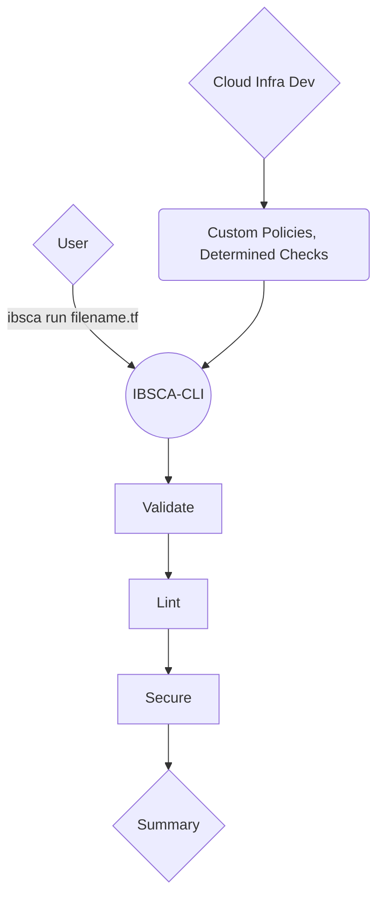

# IBSCA-CLI

Ibsca offers static code analysis tooling for Ibotta. The goal of Ibsca (Ibotta Static Code Analysis) is to automate SCA functions for developers so that they can focus on developing. Policies and Rules for validating, linting, and securing (VLS) will be maintained by Ibotta Cloud Infra. This approach will lead to cohesive, and secure code. Our tool leverages the functionality of  well maintained, open source SCA tools and customizes them to our companie's use cases.

## Installation

1. Clone repo
2. npx tsc
3. ./build/cli.js

If you are having permission issues trying to execute on mac you must chmod your cli.js file to allow execution.

> chmod +x ./build/cli.js

If you have problems with python certificates on mac, navigate to your python directory and execute **install certificates**

## Overview

Ibotta-cli is a nodejs CLI written in TypeScript and packaged with homebrew.  The goal is to create easily configurable "modules" for different static code analysis tools which can easily be swapped out for others in the future if the need arises.  Currently IBSCA will only support Terraform files however, the application leaves room for supporting other languages.

Here is a high level plan of the CLI.

## Validate

TBD

## Lint

TBD

## Secure

Utilizing [Checkov](https://www.checkov.io)
**Checkov** is a static code analysis tool for infrastructure as code (IaC) and also a software composition analysis (SCA) tool for images and open source packages.
With a robust set of commands we seek to abstract the complexity for our users. We will create custom policies for our needs at Ibotta as well as define necessary checks to perform. These are controlled by a config.yaml as well as yaml/python scripts.

### Ibsca Documentation
# Contributing to IBSCA

Below you will find a detailed guide on contributing to IBSCA.

## Adding a new Language

Follow these steps to add support for a new language to the IBSCA CLI.

 1. Store the repository locally.
 > git clone https://github.com/Howl1935/ibsca-cli
 2. Create a copy of the **template** folder 

> ./src/languages/template

 3. Rename **template** to the language of your choice in **Lowercase** letters.
 4. Rename **PackageClass.ts** to the language name in **Uppercase** letters.
 5. Open this file and rename **PackageClass** to the language name in **Uppercase** letters.
 6. Open the file ./src/languages/languages.ts
 7. Import the class you just created into this file
> import { LanguageName } from "./languageName/LanguageName"

 8. Carefully add the details of this package as a new object in languages[].  Append to the end of the current list.

     > {
     > className : ["Terraform", Terraform],
     > extension : "tf"
     > }

 9. Push your changes see **Versioning** for how to update your changes with package manager.  See **Adding a new package** for implementing a new tool in IBSCA.

## Adding a new package

Follow these steps for adding a new SCA package to IBSCA.
1. Open the the template folder located at: 
>  ./src/languages/template
2. **Copy** test the folder and contents of **./somePackage** into the language folder for which you are adding a plugin.
> example: ./src/languages/terraform
3. Rename the copied folder to the name of plugin you are implementing in **Lowercase** letters.
4. Within this folder, open **data.ts**
5. Fill out **ALL** fields.  For more details on this see the **Package Data** section.
6. Open **package.ts**
7. Rename the class to the plugin name.  Use **Uppercase** letters.
8. To initialize this plugin within your workflow, see **Inserting a Package**.

## Inserting a Package

Follow these steps to plug a package into IBSCA.
1. Navigate to the main language directory in which this plugin is defined.  
> example ./src/languages/terraform/
2. Open the language class:
> example: Terraform.ts
3. Import the plugin class that you'd like to use:
> example: import { Checkov } from './checkov/package'
4. Initialize this class as either **validate**, **lint**, **secure**.
> example: validate: new Checkov(fileName)
5. Get to analyzing!

## Versioning

Follow the guide at [IBSCA Versioning Repository](https://github.com/Howl1935/homebrew-ibsca)

