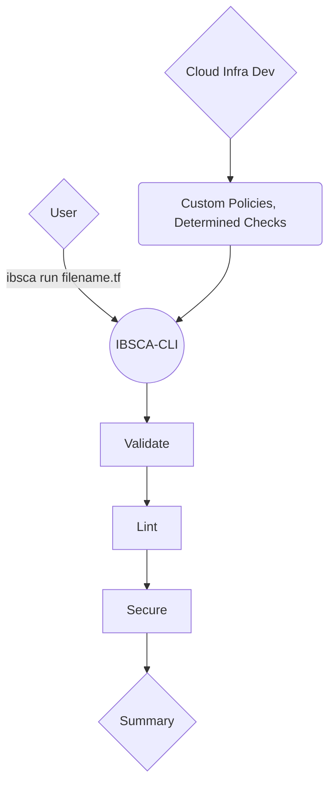

# IBSCA-CLI

This is an early stage implementation for static code analysis tooling for Ibotta. The goal of Ibsca (Ibotta Static Code Analysis) is to automate SCA functions for developers so that they can focus on developing. Policies and Rules for validating, linting, and securing (VLS) will be maintained by Ibotta Cloud Infra. This approach will lead to cohesive, and secure code. Our tool leverages the functionality of several well maintained SCA tools and customizes them to our companies use cases.

## Installation

1. Clone repo
2. npx tsc
3. ./build/cli.js

If you are having permission issues trying to execute on mac you must chmod your cli.js file to allow execution.

> chmod +x ./build/cli.js

If you have problems with python certificates on mac, navigate to your python directory and execute **install certificates**

## Overview

Ibotta-cli is a nodejs CLI written in TypeScript and packaged with homebrew.  The goal is to create easily configurable "modules" for different static code analysis tools which can easily be swapped out for others in the future if the need arises.  Currently IBSCA will only support Terraform files however, another design goal is to leave room for supporting other languages.

Here is a high level plan of the CLI.

## Validate

TBD

## Lint

TBD

## Secure

Utilizing [Checkov](https://www.checkov.io)
**Checkov** is a static code analysis tool for infrastructure as code (IaC) and also a software composition analysis (SCA) tool for images and open source packages.
With a robust set of commands we seek to abstract the complexity for our users. We will create custom policies for our needs at Ibotta as well as define necessary checks to perform. These are controlled by a config.yaml as well as yaml/python scripts.
